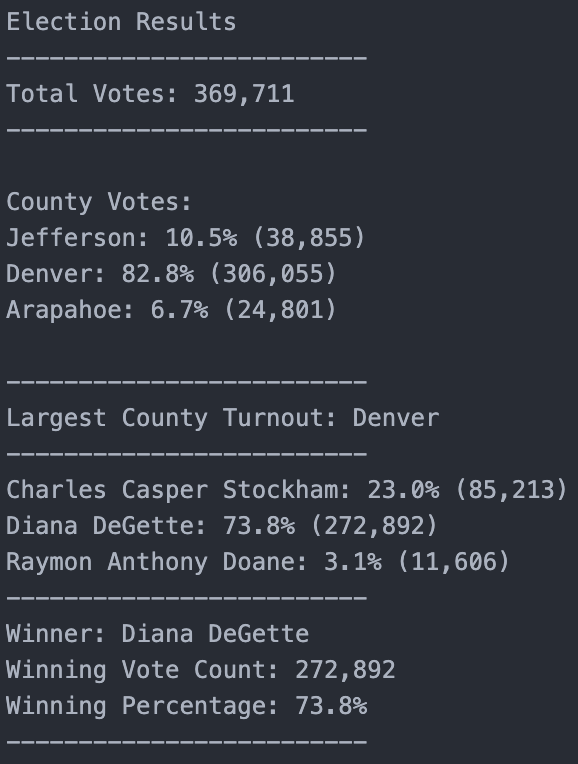

# PyPoll with Python

## Project Overview

A Colorado Board of Elections employee has given the following tasks to complete the election audit of a recent local election.

1. Calculate the total number of votes cast.
2. Get a complete list of candidates who received votes.
3. Calculate the total number of votes each candidate received.
4. Calculate the total percentage of votes each candidate won.
5. Determine the winner of the election based on popular vote.
6. Get a list of each county.
7. Get the percentage of total votes for each county.
8. Get the number of total votes for each county.
9. Calculate which county had the largest turnout.

## Resources

- Data Source: election_results.csv
- Software: Python 3.10.0, Visual Studio Code 1.66.0
- Output: election_analysis.txt

## Summary

The analysis of the election shows that:
- There were 369,711 votes cast in the election.
- The candidates were:
  - Charles Casper Stockham
  - Diana DeGette
  - Raymon Anthony Doane
  - To create a list of unique candidates the following code was used:
     ```python
      # If the candidate name does not exist in the candidate options list:
      if candidate_name not in candidate_options:
        # Add the candidate name to the candidate list.
        candidate_options.append(candidate_name)
        # And begin tracking that candidate's voter count.
        candidate_votes[candidate_name] = 0
     ```
- The candidate results were:
  - Charles Casper Stockham received 23.0% of the vote and 85,213 total votes.
  - Diana DeGette received 73.8% of the vote and 272,892 total votes.
  - Raymon Anthony Doane received 3.1% of the vote and 11,606 total votes.
- The winner of the election was:
  - Candidate Diana DeGette, who received 73.8% of the vote and 272,892 total votes.
- Breakdown of the number of votes and the percentage of total votes for each county in the precinct.
  - Jefferson county received 10.5% of the vote and 38,855 total votes.
  - Denver county received 82.8% of the vote and 306,055 total votes.
  - Arapahoe county received 6.7% of the vote and 24,801 total votes.
- The county with the largest turnout was:
  - Denver had the largest percentage of votes with 82.8% and a total of 306,055 votes.
  - To get information for the largest county, to the following code was used:
    ```python
    # if the current county's vote is larger than the previous county's vote:
    if (votes_by_county > largest_county_vote):
      # Update the largest county
      largest_county = county_name
      # Update the vote for the largest county
      largest_county_vote = votes_by_county
    ```

Upon running the code for this election audit a file will be created containing the results. A screenshot of what these results will look like can be seen below.



The followung sample of code was used in order to create and write to a newly created text file:
```python
# Creates a new text file "election_analysis" and assigns it to the variable file_to_save
file_to_save = os.path.join("analysis", "election_analysis.txt")
# Opens the text file with the "w" denoting that it is to be written to
with open(file_to_save, "w") as txt_file:
  # Created a variable that holds formatted information ready to be written to the file
  election_results = (
    f"\nElection Results\n"
    f"-------------------------\n"
    f"Total Votes: {total_votes:,}\n"
    f"-------------------------\n\n"
    f"County Votes:\n")
  # Writes to the file
  txt_file.write(election_results)
```

## Election Audit Summary:

While this script was tailor-made for this local Colorado election, it could easily be made into a far more dynamic program that could handle audits for all kinds of elections. For example, if this script was to be used for a presidential election, one could modify the code to include various data points for each candidate such as the state they represent, the number of votes they receive in each state and county, a timeline of electoral votes based on when each state completes their election, information relating to which parties voted for which candidate, and much more.


